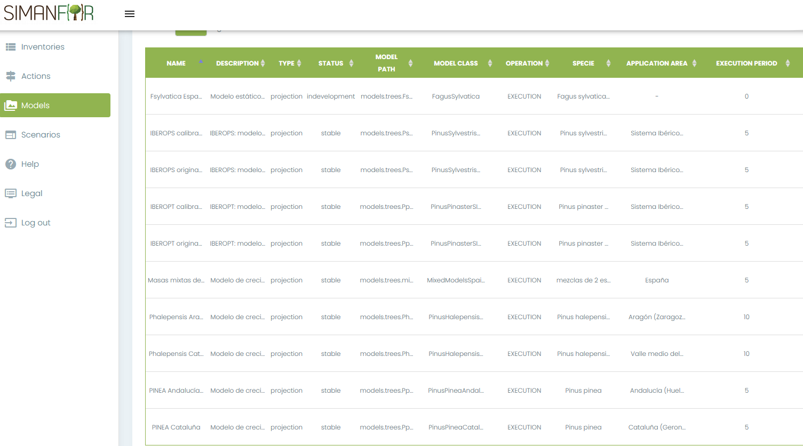

# Sheets for individual tree models available in

---

This folder contains the description sheets of SIMANFOR individual tree models. The name of the sheets coincides with the name of the model we selected in the SIMANFOR web site, obeying (usually) the following order:

* **Species**, i.e. *Pradiata_* (pino radiata)
* **Application area**, i.e. *_gal* (Galicia)

Full name: *Pradiata_Galicia*

Below is the [SIMANFOR](https://www.simanfor.es/models) model selection screen where you can check the name of the model you want to use:

---

## 📧 Contact

*For any questions or suggestions, you can contact the SIMANFOR technical team at simanfor.forest@uva.es*.

---

