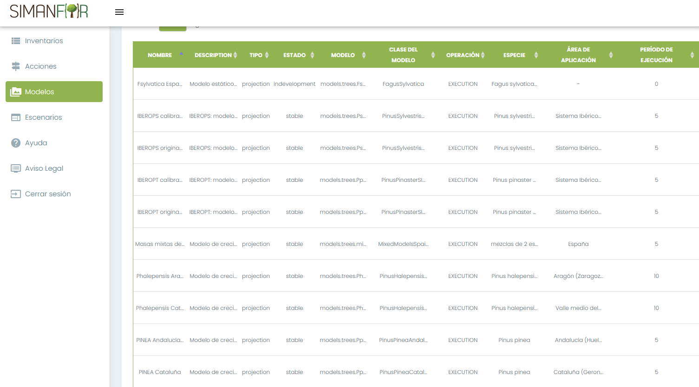

# Fichas descriptivas para modelos de árbol individual de

---

Esta carpeta contiene las fichas descriptivas de modelos de árbol individual de SIMANFOR. El nombre de las fichas coincide con el nombre del modelo que seleccionamos en la web de SIMANFOR, obedeciendo (por lo general) al siguiente orden:
* **Especie**, p.e. *Pradiata_* (pino radiata)
* **Zona para la que fue desarrollado**, p.e. *_gal* (Galicia)

Nombre completo: *Pradiata_Galicia*

A continuación se muestra la pantalla de selección de modelos de [SIMANFOR](https://www.simanfor.es/models) donde puedes consultar el nombre del modelos que quieres utilizar:

---

## 📧 Contacto

*Para cualquier duda o sugerencia puedes contactar con el equipo técnico de SIMANFOR en simanfor.forest@uva.es*.

---

