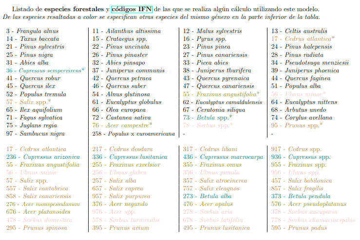
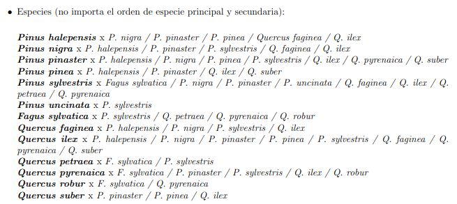

# Modelos disponibles en

---

🇪🇸 **Estas viendo el contenido del repositorio en español**  

🇬🇧 *[English version here](../english/detailed_model_list.md)*

---

### 💡 Si quieres buscar una especie en concreto, utiliza `Ctrl + F` en esta misma página e inserta su nombre (preferiblemente el nombre científico).

---

#  Modelos de masa

👉 *Nombre del modelo*: **[masa] Bpubescens Galicia**

📜 *Descripción*: Modelo dinámico de masa para *Betula pubescens* en Galicia (España)

🌳 *Especie objetivo*: *Betula pubescens* (abedul)

🗺️ *Zona de aplicación*: Galicia (España)

⏱️ *Periodo de ejecución*: 1 año

🔢 *Inventarios*: utiliza esta [plantilla de inventario](https://github.com/simanfor/inventarios/raw/refs/heads/main/plantillas/plantilla_inventario_SIMANFOR-ES-datos_Ppinaster_IBEROPT.xlsx) o los inventarios dirigidos a este modelo con 1 parcela, 3 parcelas todas las parcelas del Inventario Forestal Nacional Español que encontrarás [aquí](https://github.com/simanfor/inventarios/tree/main/ejemplos/modelos_masa)

📚 *Documentación del modelo*: documentación en [español](https://github.com/simanfor/modelos/blob/main/espanol/masa/Bpubescens_gal_stand_ES.pdf) e [inglés](https://github.com/simanfor/modelos/blob/main/english/stand/Bpubescens_gal_stand_EN.pdf)

---

👉 *Nombre del modelo*: **[masa] Cladanifer Zamora**

📜 *Descripción*: Modelo dinámico de masa para Cistus ladanifer en Zamora (España)

🌳 *Especie objetivo*: *Cistus ladanifer* (jara pringosa, ládano)

🗺️ *Zona de aplicación*: Zamora (España)

⏱️ *Periodo de ejecución*: 5 años

🔢 *Inventarios*: utiliza este [inventario de prueba](https://github.com/simanfor/inventarios/blob/main/ejemplos/Cladanifer.xlsx)

📚 *Documentación del modelo*: documentación en [español](https://github.com/simanfor/modelos/blob/main/espanol/masa/Cladanifer_stand_ES.pdf) e [inglés](https://github.com/simanfor/modelos/blob/main/english/stand/Cladanifer_stand_EN.pdf)

---

👉 *Nombre del modelo*: **[masa] Pnigra Castilla y León**

📜 *Descripción*: Modelo dinámico de masa para Pinus nigra en Castilla y León (España)

🌳 *Especie objetivo*: *Pinus nigra* (pino salgareño)

🗺️ *Zona de aplicación*: Castilla y León (España)

⏱️ *Periodo de ejecución*: 5 años

🔢 *Inventarios*: utiliza esta [plantilla de inventario](https://github.com/simanfor/inventarios/raw/refs/heads/main/plantillas/plantilla_inventario_SIMANFOR-ES-datos_Ppinaster_IBEROPT.xlsx) o los inventarios dirigidos a este modelo con 1 parcela, 3 parcelas todas las parcelas del Inventario Forestal Nacional Español que encontrarás [aquí](https://github.com/simanfor/inventarios/tree/main/ejemplos/modelos_masa)

📚 *Documentación del modelo*: documentación en [español](https://github.com/simanfor/modelos/blob/main/espanol/masa/Pnigra_cyl_stand_ES.pdf) e [inglés](https://github.com/simanfor/modelos/blob/main/english/stand/Pnigra_cyl_stand_EN.pdf)

---

👉 *Nombre del modelo*: **[masa] Populus NE España**

📜 *Descripción*: Modelo dinámico de masa para Populus sp. en el Noreste de España

🌳 *Especie objetivo*: *Populus sp.* (chopo)

🗺️ *Zona de aplicación*: Nordeste de España

⏱️ *Periodo de ejecución*: libre (años)

🔢 *Inventarios*: utiliza esta [plantilla de inventario](https://github.com/simanfor/inventarios/raw/refs/heads/main/plantillas/plantilla_inventario_SIMANFOR-ES-datos_Ppinaster_IBEROPT.xlsx) o los inventarios dirigidos a este modelo con 1 parcela, 3 parcelas todas las parcelas del Inventario Forestal Nacional Español que encontrarás [aquí](https://github.com/simanfor/inventarios/tree/main/ejemplos/modelos_masa)

📚 *Documentación del modelo*: ⚠️ no disponible

---

👉 *Nombre del modelo*: **[masa] Ppinaster costa Galicia**

📜 *Descripción*: Modelo dinámico de masa para Pinus pinaster en zonas costeras de Galicia (España)

🌳 *Especie objetivo*: *Pinus pinaster atlantica* (pino resinero, pino rodeno, pino marítimo, pino rubial, pino negral)

🗺️ *Zona de aplicación*: Galicia (España)

⏱️ *Periodo de ejecución*: 1 año

🔢 *Inventarios*: utiliza esta [plantilla de inventario](https://github.com/simanfor/inventarios/raw/refs/heads/main/plantillas/plantilla_inventario_SIMANFOR-ES-datos_Ppinaster_IBEROPT.xlsx) o los inventarios dirigidos a este modelo con 1 parcela, 3 parcelas todas las parcelas del Inventario Forestal Nacional Español que encontrarás [aquí](https://github.com/simanfor/inventarios/tree/main/ejemplos/modelos_masa)

📚 *Documentación del modelo*: documentación en [español](https://github.com/simanfor/modelos/blob/main/espanol/masa/Ppinaster_atlantica_stand_gal_coast_ES.pdf) e [inglés](https://github.com/simanfor/modelos/blob/main/english/stand/Ppinaster_atlantica_stand_gal_coast_EN.pdf)

---

👉 *Nombre del modelo*: **[masa] Ppinaster interior Galicia**

📜 *Descripción*: Modelo dinámico de masa para Pinus pinaster en zonas de interior de Galicia (España)

🌳 *Especie objetivo*: *Pinus pinaster atlantica* (pino resinero, pino rodeno, pino marítimo, pino rubial, pino negral)

🗺️ *Zona de aplicación*: Galicia (España)

⏱️ *Periodo de ejecución*: 1 año

🔢 *Inventarios*: utiliza esta [plantilla de inventario](https://github.com/simanfor/inventarios/raw/refs/heads/main/plantillas/plantilla_inventario_SIMANFOR-ES-datos_Ppinaster_IBEROPT.xlsx) o los inventarios dirigidos a este modelo con 1 parcela, 3 parcelas todas las parcelas del Inventario Forestal Nacional Español que encontrarás [aquí](https://github.com/simanfor/inventarios/tree/main/ejemplos/modelos_masa)

📚 *Documentación del modelo*: documentación en [español](https://github.com/simanfor/modelos/blob/main/espanol/masa/Ppinaster_atlantica_stand_gal_inland_ES.pdf) e [inglés](https://github.com/simanfor/modelos/blob/main/english/stand/Ppinaster_atlantica_stand_gal_inland_EN.pdf)

---

👉 *Nombre del modelo*: **[masa] Ppinaster mesogeensis Península Ibérica**

📜 *Descripción*: Modelo dinámico de masa para Pinus pinaster mesogeensis en la Península Ibérica (España)

🌳 *Especie objetivo*: *Pinus pinaster mesogeensis* (pino resinero, pino rodeno, pino marítimo, pino rubial, pino negral)

🗺️ *Zona de aplicación*: Península Ibérica (España)

⏱️ *Periodo de ejecución*: 5 años

🔢 *Inventarios*: utiliza esta [plantilla de inventario](https://github.com/simanfor/inventarios/raw/refs/heads/main/plantillas/plantilla_inventario_SIMANFOR-ES-datos_Ppinaster_IBEROPT.xlsx) o los inventarios dirigidos a este modelo con 1 parcela, 3 parcelas todas las parcelas del Inventario Forestal Nacional Español que encontrarás [aquí](https://github.com/simanfor/inventarios/tree/main/ejemplos/modelos_masa)

📚 *Documentación del modelo*: documentación en [español](https://github.com/simanfor/modelos/blob/main/espanol/masa/Ppinaster_mesogeensis_ip_stand_ES.pdf) e [inglés](https://github.com/simanfor/modelos/blob/main/english/stand/Ppinaster_mesogeensis_ip_stand_EN.pdf)

---

👉 *Nombre del modelo*: **[masa] Pradiata Galicia**

📜 *Descripción*: Modelo dinámico de masa para Pinus radiata en Galicia (España)

🌳 *Especie objetivo*: *Pinus radiata* (pino insigne, pino de Monterrey, pino de California)

🗺️ *Zona de aplicación*: Galicia (España)

⏱️ *Periodo de ejecución*: 1 año

🔢 *Inventarios*: utiliza esta [plantilla de inventario](https://github.com/simanfor/inventarios/raw/refs/heads/main/plantillas/plantilla_inventario_SIMANFOR-ES-datos_Ppinaster_IBEROPT.xlsx) o los inventarios dirigidos a este modelo con 1 parcela, 3 parcelas todas las parcelas del Inventario Forestal Nacional Español que encontrarás [aquí](https://github.com/simanfor/inventarios/tree/main/ejemplos/modelos_masa)

📚 *Documentación del modelo*: documentación en [español](https://github.com/simanfor/modelos/blob/main/espanol/masa/Pradiata_gal_stand_ES.pdf) e [inglés](https://github.com/simanfor/modelos/blob/main/english/stand/Pradiata_gal_stand_EN.pdf)

---

👉 *Nombre del modelo*: **[masa] Psylvestris Galicia**

📜 *Descripción*: Modelo dinámico de masa para Pinus sylvestris en Galicia (España)

🌳 *Especie objetivo*: *Pinus sylvestris* (pino silvestre, pino serrano, pino albar, pino rojo, pino bermejo, pino de Valsaín)

🗺️ *Zona de aplicación*: Galicia (España)

⏱️ *Periodo de ejecución*: 1 año

🔢 *Inventarios*: utiliza esta [plantilla de inventario](https://github.com/simanfor/inventarios/raw/refs/heads/main/plantillas/plantilla_inventario_SIMANFOR-ES-datos_Ppinaster_IBEROPT.xlsx) o los inventarios dirigidos a este modelo con 1 parcela, 3 parcelas todas las parcelas del Inventario Forestal Nacional Español que encontrarás [aquí](https://github.com/simanfor/inventarios/tree/main/ejemplos/modelos_masa)

📚 *Documentación del modelo*: documentación en [español](https://github.com/simanfor/modelos/blob/main/espanol/masa/Psylvestris_stand_gal_ES.pdf) e [inglés](https://github.com/simanfor/modelos/blob/main/english/stand/Psylvestris_stand_gal_EN.pdf)

---

👉 *Nombre del modelo*: **[masa] Psylvestris Alto Valle del Ebro**

📜 *Descripción*: Modelo dinámico de masa para Pinus sylvestris en el Alto Valle del Ebro (España)

🌳 *Especie objetivo*: *Pinus sylvestris* (pino silvestre, pino serrano, pino albar, pino rojo, pino bermejo, pino de Valsaín)

🗺️ *Zona de aplicación*: Alto Valle del Ebro (España)

⏱️ *Periodo de ejecución*: 5 años

🔢 *Inventarios*: utiliza esta [plantilla de inventario](https://github.com/simanfor/inventarios/raw/refs/heads/main/plantillas/plantilla_inventario_SIMANFOR-ES-datos_Ppinaster_IBEROPT.xlsx) o los inventarios dirigidos a este modelo con 1 parcela, 3 parcelas todas las parcelas del Inventario Forestal Nacional Español que encontrarás [aquí](https://github.com/simanfor/inventarios/tree/main/ejemplos/modelos_masa)

📚 *Documentación del modelo*: documentación en [español](https://github.com/simanfor/modelos/blob/main/espanol/masa/Psylvestris_stand_ebro_ES.pdf) e [inglés](https://github.com/simanfor/modelos/blob/main/english/stand/Psylvestris_stand_ebro_EN.pdf)

---

👉 *Nombre del modelo*: **[masa] Psylvestris Ucrania**

📜 *Descripción*: Modelo dinámico de masa para Pinus sylvestris en Ucrania

🌳 *Especie objetivo*: *Pinus sylvestris* (pino silvestre, pino serrano, pino albar, pino rojo, pino bermejo, pino de Valsaín)

🗺️ *Zona de aplicación*: Ucrania

⏱️ *Periodo de ejecución*: 5 años

🔢 *Inventarios*: utiliza esta [plantilla de inventario](https://github.com/simanfor/inventarios/raw/refs/heads/main/plantillas/plantilla_inventario_SIMANFOR-ES-datos_Ppinaster_IBEROPT.xlsx) o los inventarios dirigidos a este modelo con 1 parcela, 3 parcelas todas las parcelas del Inventario Forestal Nacional Español que encontrarás [aquí](https://github.com/simanfor/inventarios/tree/main/ejemplos/modelos_masa)

📚 *Documentación del modelo*: documentación en [español](https://github.com/simanfor/modelos/blob/main/espanol/masa/Psylvestris_stand_ukraine_ES.pdf) e [inglés](https://github.com/simanfor/modelos/blob/main/english/stand/Psylvestris_stand_ukraine_EN.pdf)

---

👉 *Nombre del modelo*: **[masa] Psylvestris Madrid (SILVES)**

📜 *Descripción*: SILVES: Modelo dinámico de masa para Pinus sylvestris en Madrid (España)

🌳 *Especie objetivo*: *Pinus sylvestris* (pino silvestre, pino serrano, pino albar, pino rojo, pino bermejo, pino de Valsaín)

🗺️ *Zona de aplicación*: Madrid (España)

⏱️ *Periodo de ejecución*: 10 ó 15 años

🔢 *Inventarios*: utiliza esta [plantilla de inventario](https://github.com/simanfor/inventarios/raw/refs/heads/main/plantillas/plantilla_inventario_SIMANFOR-ES-datos_Ppinaster_IBEROPT.xlsx) o los inventarios dirigidos a este modelo con 1 parcela, 3 parcelas todas las parcelas del Inventario Forestal Nacional Español que encontrarás [aquí](https://github.com/simanfor/inventarios/tree/main/ejemplos/modelos_masa)

📚 *Documentación del modelo*: documentación en [español](https://github.com/simanfor/modelos/blob/main/espanol/masa/Psylvestris_stand_SILVES_mad_ES.pdf) e [inglés](https://github.com/simanfor/modelos/blob/main/english/stand/Psylvestris_stand_SILVES_mad_EN.pdf)

---

👉 *Nombre del modelo*: **[masa] Psylvestris Sistema Ibérico y Sistema Central (SILVES)**

📜 *Descripción*: SILVES: Modelo dinámico de masa para Pinus sylvestris en el Sistema Ibérico y Sistema Central (España)

🌳 *Especie objetivo*: *Pinus sylvestris* (pino silvestre, pino serrano, pino albar, pino rojo, pino bermejo, pino de Valsaín)

🗺️ *Zona de aplicación*: Sistema Ibérico y Sistema Central (España)

⏱️ *Periodo de ejecución*: 10 ó 15 años

🔢 *Inventarios*: utiliza esta [plantilla de inventario](https://github.com/simanfor/inventarios/raw/refs/heads/main/plantillas/plantilla_inventario_SIMANFOR-ES-datos_Ppinaster_IBEROPT.xlsx) o los inventarios dirigidos a este modelo con 1 parcela, 3 parcelas todas las parcelas del Inventario Forestal Nacional Español que encontrarás [aquí](https://github.com/simanfor/inventarios/tree/main/ejemplos/modelos_masa)

📚 *Documentación del modelo*: documentación en [español](https://github.com/simanfor/modelos/blob/main/espanol/masa/Psylvestris_stand_SILVES_sisc_ES.pdf) e [inglés](https://github.com/simanfor/modelos/blob/main/english/stand/Psylvestris_stand_SILVES_sisc_EN.pdf)

---

👉 *Nombre del modelo*: **[masa] Qpetraea Cordillera Cantábrica**

📜 *Descripción*: Modelo estático de masa para Quercus petraea en la Cordillera Cantábrica (España)

🌳 *Especie objetivo*: *Quercus petraea* (roble albar)

🗺️ *Zona de aplicación*: Cordillera Cantábrica (España)

⏱️ *Periodo de ejecución*: ⚠️ este modelo no permite ejecuciones, es un modelo **estático** ⚠️

🔢 *Inventarios*: utiliza esta [plantilla de inventario](https://github.com/simanfor/inventarios/raw/refs/heads/main/plantillas/plantilla_inventario_SIMANFOR-ES-datos_Ppinaster_IBEROPT.xlsx) o los inventarios dirigidos a este modelo con 1 parcela, 3 parcelas todas las parcelas del Inventario Forestal Nacional Español que encontrarás [aquí](https://github.com/simanfor/inventarios/tree/main/ejemplos/modelos_masa)

📚 *Documentación del modelo*: documentación en [español](https://github.com/simanfor/modelos/blob/main/espanol/masa/Qpetraea_cant_stand_ES.pdf) e [inglés](https://github.com/simanfor/modelos/blob/main/english/stand/Qpetraea_cant_stand_EN.pdf)

---

👉 *Nombre del modelo*: **[masa] Qrobur Galicia**

📜 *Descripción*: Modelo dinámico de masa para Quercus robur en Galicia (España)

🌳 *Especie objetivo*: *Quercus robur* (roble común, roble albar, roble carballo, carvallo, cajiga, roble fresnal)

🗺️ *Zona de aplicación*: Galicia (España)

⏱️ *Periodo de ejecución*: 1 año

🔢 *Inventarios*: utiliza esta [plantilla de inventario](https://github.com/simanfor/inventarios/raw/refs/heads/main/plantillas/plantilla_inventario_SIMANFOR-ES-datos_Ppinaster_IBEROPT.xlsx) o los inventarios dirigidos a este modelo con 1 parcela, 3 parcelas todas las parcelas del Inventario Forestal Nacional Español que encontrarás [aquí](https://github.com/simanfor/inventarios/tree/main/ejemplos/modelos_masa)

📚 *Documentación del modelo*: documentación en [español](https://github.com/simanfor/modelos/blob/main/espanol/masa/Qrobur_gal_stand_ES.pdf) e [inglés](https://github.com/simanfor/modelos/blob/main/english/stand/Qrobur_gal_stand_EN.pdf)

---

👉 *Nombre del modelo*: **[masa] Rumanía (Romanian model)**

📜 *Descripción*: Modelo dinámico de masa para distintas especies de Rumanía (Dynamic stand model for different species in Romania)

🌳 *Especie objetivo*: 

| Code | Romanian Name       | Latin Name                     |
|------|---------------------|--------------------------------|
| BR   | BRAD                | *Albies alba*                    |
| CA   | CARPEN              | *Carpinus betulus*              |
| CE   | CER                 | *Quercus cerris*                |
| FA   | FAG                 | *Fagus sylvatica*               |
| GO   | GORUN               | *Quercus petraea*               |
| LA   | LARICE              | *Larix decidua*                 |
| ME   | MESTEACĂN           | *Betula pendula*                |
| MO   | MOLID               | *Picea abies*                   |
| PIN  | PIN NEGRU           | *Pinus nigra* ssp. *nigra* arn.   |
| PI   | PIN SILVESTRU       | *Pinus sylvestris*              |
| PLA  | PLOP ALB            | *Populus alba*                  |
| PLN  | PLOP NEGRU          | *Populus nigra*                 |
| SC   | SALCÂM              | *Robinia pseudoacacia*          |
| STB  | STEJAR BRUMĂRIU     | *Quercus pedunculiflora*        |
| ST   | STEJAR PEDUNCULAT   | *Quercus robur*                 |
| STP  | STEJAR PUFOS        | *Quercus pubescens*             |
| TE   | TEI ARGINTIU        | *Tilia tomentosa*               |

🗺️ *Zona de aplicación*: Rumanía

⏱️ *Periodo de ejecución*: 5 años (periodo recomendado, pero no obligatorio)

🔢 *Inventarios*: utiliza este [inventario de ejemplo](https://github.com/simanfor/inventarios/blob/main/ejemplos/Romanian_stand.xlsx)

📚 *Documentación del modelo*: ⚠️ no disponible

---

👉 *Nombre del modelo*: **[masa] Tgrandis Campeche (México)**

📜 *Descripción*: Modelo de crecimiento para masas de teca (Tectona grandis) en Campeche (México)

🌳 *Especie objetivo*: *Tectona grandis* (teca)

🗺️ *Zona de aplicación*: Campeche (México)

⏱️ *Periodo de ejecución*: ⚠️ períodos de ejecución en meses (sin restricciones de valor) ⚠️

🔢 *Inventarios*: utiliza este [inventario de ejemplo](https://github.com/simanfor/inventarios/blob/main/ejemplos/Tgrandis_Campeche.xlsx)

📚 *Documentación del modelo*: ⚠️ no disponible

---

# Modelos de árbol individual

---

👉 *Nombre del modelo*: **Cálculo de alturas (España)**

📜 *Descripción*: Modelo estático de árbol individual destinado exclusivamente al cálculo de alturas (no permite proyecciones) de las principales especies forestales de España

🌳 *Lista de especies objetivo*: 
*Abies alba*  
*Abies pinsapo*  
*Acacia dealbata*  
*Acacia melanoxylon*  
*Acer campestre*  
*Acer monspessulanum*  
*Acer opalus*  
*Acer pseudoplatanus*  
*Alnus glutinosa*  
*Arbutus unedo*  
*Betula alba*  
*Betula pendula*  
*Castanea sativa*  
*Cedrus atlantica*  
*Cedrus libani*  
*Celtis australis*  
*Chamaecyparis lawsoniana*  
*Corylus avellana*  
*Crataegus monogyna*  
*Cupressus arizonica*  
*Cupressus sempervirens*  
*Eucalyptus camaldulensis*  
*Eucalyptus globulus*  
*Eucalyptus gomphocephalus*  
*Eucalyptus nitens*  
*Eucalyptus robusta*  
*Eucalyptus viminalis*  
*Fagus sylvatica*  
*Fraxinus angustifolia*  
*Fraxinus excelsior*  
*Ilex aquifolium*  
*Ilex canariensis*  
*Juglans regia*  
*Juniperus communis*  
*Juniperus oxycedrus*  
*Juniperus phoenicea*  
*Juniperus thurifera*  
*Larix decidua*  
*Laurus azorica*  
*Laurus nobilis*  
*Myrica faya*  
*Olea europaea*  
*Other eucalypts*  
*Persea indica*  
*Phillyrea latifolia*  
*Phoenix canariensis*  
*Picea abies*  
*Pinus canariensis*  
*Pinus halepensis*  
*Pinus nigra*  
*Pinus pinaster*  
*Pinus pinea*  
*Pinus radiata*  
*Pinus sylvestris*  
*Pinus uncinata*  
*Platanus hispanica*  
*Populus alba*  
*Populus nigra*  
*Populus tremula*  
*Populus x canadensis*  
*Prunus avium*  
*Pseudotsuga menziesii*  
*Quercus canariensis*  
*Quercus faginea*  
*Quercus ilex*  
*Quercus petraea*  
*Quercus pubescens*  
*Quercus pyrenaica*  
*Quercus robur*  
*Quercus rubra*  
*Quercus suber*  
*Robinia pseudoacacia*  
*Salix alba*  
*Salix atrocinerea*  
*Salix caprea*  
*Salix fragilis*  
*Sorbus aria*  
*Sorbus aucuparia*  
*Sorbus torminalis*  
*Taxus baccata*  
*Tilia cordata*  
*Tilia platyphyllos*  
*Ulmus glabra*  
*Ulmus minor*

🗺️ *Zona de aplicación*: España

⏱️ *Periodo de ejecución*: ⚠️ este modelo no permite ejecuciones, es un modelo **estático** ⚠️

🔢 *Inventarios*: utiliza esta [plantilla de inventario](https://github.com/simanfor/inventarios/blob/main/ejemplos/Calcular_alturas_Espana.xlsx)

📚 *Documentación del modelo*: ⚠️ no disponible

---

👉 *Nombre del modelo*: **Cálculo de existencias (España)**

📜 *Descripción*: Modelo estático de árbol individual destinado al cálculo de existencias (no permite proyecciones) de las principales especies forestales de España

🌳 *Lista de especies objetivo*:

🗺️ *Zona de aplicación*: España

⏱️ *Periodo de ejecución*: ⚠️ este modelo no permite ejecuciones, es un modelo **estático** ⚠️

🔢 *Inventarios*: utiliza esta [plantilla de inventario](https://github.com/simanfor/inventarios/raw/refs/heads/main/plantillas/plantilla_inventario_SIMANFOR-ES-datos_Ppinaster_IBEROPT.xlsx) o el inventario de cualquier otro modelo de árbol individual a modo de ejemplo

📚 *Documentación del modelo*: documentación en [español](https://github.com/simanfor/modelos/blob/main/espanol/arbol_individual/Existencias_Espana.pdf) e [inglés](https://github.com/simanfor/modelos/blob/main/english/individual_tree/Existencias_Espana.pdf)

---

👉 *Nombre del modelo*: **Masas mixtas de España**

📜 *Descripción*: Modelo de crecimiento de árbol individual independiente de la distancia para masas mixtas de España

🌳 *Especie objetivo*: Masas mixtas de 2 especies con las siguientes combinaciones (no importa el orden de especies):

<!--  -->

*Pinus halepensis × P. nigra / P. pinaster / P. pinea / Quercus faginea / Q. ilex*

*Pinus nigra × P. halepensis / P. pinaster / P. sylvestris / Q. faginea / Q. ilex*

*Pinus pinaster × P. halepensis / P. nigra / P. pinea / P. sylvestris / Q. ilex / Q. pyrenaica / Q. suber*

*Pinus pinea × P. halepensis / P. pinaster / Q. ilex / Q. suber*

*Pinus sylvestris × Fagus sylvatica / P. nigra / P. pinaster / P. uncinata / Q. faginea / Q. ilex / Q. petraea / Q. pyrenaica*

*Pinus uncinata × P. sylvestris*

*Fagus sylvatica × P. sylvestris / Q. petraea / Q. pyrenaica / Q. robur*

*Quercus faginea × P. halepensis / P. nigra / P. pinaster / P. sylvestris / Q. ilex*

*Quercus ilex × P. halepensis / P. nigra / P. pinaster / P. pinea / P. sylvestris / Q. faginea / Q. pyrenaica / Q. suber*

*Quercus petraea × F. sylvatica / P. sylvestris*

*Quercus pyrenaica × F. sylvatica / P. pinaster / P. sylvestris / Q. ilex / Q. robur*

*Quercus robur × F. sylvatica / Q. pyrenaica*

*Quercus suber × P. pinaster / P. pinea / Q. ilex*

🗺️ *Zona de aplicación*: España

⏱️ *Periodo de ejecución*: 5 años

🔢 *Inventarios*: utiliza esta [plantilla de inventario](https://github.com/simanfor/inventarios/raw/refs/heads/main/plantillas/plantilla_inventario_SIMANFOR-ES-datos_Ppinaster_IBEROPT.xlsx) o los inventarios dirigidos a este modelo con 1 parcela, 3 parcelas todas las parcelas del Inventario Forestal Nacional Español que encontrarás [aquí](https://github.com/simanfor/inventarios/tree/main/ejemplos/modelos_arbol_individual-masas_mixtas) para las distintas mezclas de especies

📚 *Documentación del modelo*: documentación en [español](https://github.com/simanfor/modelos/blob/main/espanol/arbol_individual/Masas_mixtas_Espana.pdf) e [inglés](https://github.com/simanfor/modelos/blob/main/english/individual_tree/Masas_mixtas_Espana.pdf)

---

👉 *Nombre del modelo*: **Phalepensis Aragón**

📜 *Descripción*: Modelo de crecimiento de árbol individual para Pinus halepensis de Aragón (España)

🌳 *Especie objetivo*: *Pinus halepensis* (pino carrasco, pino blanco)

🗺️ *Zona de aplicación*: Zaragoza, Huesca y Teruel (España)

⏱️ *Periodo de ejecución*: 10 años

🔢 *Inventarios*: https://github.com/simanfor/inventarios/tree/main/ejemplos/modelos_arbol_individual-masas_puras

📚 *Documentación del modelo*: documentación en [español](https://github.com/simanfor/modelos/blob/main/espanol/arbol_individual/Phalepensis_Cataluna.pdf) e [inglés](https://github.com/simanfor/modelos/blob/main/english/individual_tree/Phalepensis_Aragon.pdf)

---

👉 *Nombre del modelo*: **Phalepensis Cataluña y Aragón**

📜 *Descripción*: Modelo de crecimiento de árbol individual para Pinus halepensis de Cataluña y Aragón (España)

🌳 *Especie objetivo*: *Pinus halepensis* (pino carrasco, pino blanco)

🗺️ *Zona de aplicación*: Valle medio del Ebro (Aragón) y Cataluña (Huesca, Zaragoza, Girona, Barcelona, Lleida y Tarragona; España)

⏱️ *Periodo de ejecución*: 10 años

🔢 *Inventarios*: https://github.com/simanfor/inventarios/tree/main/ejemplos/modelos_arbol_individual-masas_puras

📚 *Documentación del modelo*: documentación en [español](https://github.com/simanfor/modelos/blob/main/espanol/arbol_individual/Phalepensis_CatalunaAragon.pdf) e [inglés](https://github.com/simanfor/modelos/blob/main/english/individual_tree/Phalepensis_CatalunaAragon.pdf)

---

👉 *Nombre del modelo*: **Pnigra Cataluña**

📜 *Descripción*: Modelo de crecimiento de árbol individual para Pinus nigra de Cataluña (España)

🌳 *Especie objetivo*: *Pinus nigra* (pino salgareño)

🗺️ *Zona de aplicación*: Cataluña: Gerona, Lleida, Barcelona y Tarragona (España)

⏱️ *Periodo de ejecución*: 5 años

🔢 *Inventarios*: https://github.com/simanfor/inventarios/tree/main/ejemplos/modelos_arbol_individual-masas_puras

📚 *Documentación del modelo*: documentación en [español](https://github.com/simanfor/modelos/blob/main/espanol/arbol_individual/Pnigra_Cataluna.pdf) e [inglés](https://github.com/simanfor/modelos/blob/main/english/individual_tree/Pnigra_Cataluna.pdf)

---

👉 *Nombre del modelo*: **Ppinaster en el Sistema Ibérico Meridional (IBEROPT) original**

📜 *Descripción*: IBEROPT: modelo de crecimiento de árbol individual para Pinus pinaster mesogeensis en el Sistema Ibérico Meridional (España) - parametrización original

🌳 *Especie objetivo*: *Pinus pinaster mesogeensis* (pino resinero, pino rodeno, pino marítimo, pino rubial, pino negral)

🗺️ *Zona de aplicación*: Sistema Ibérico: Soria, Guadalajara, Cuenca y Teruel (España)

⏱️ *Periodo de ejecución*: 5 años

🔢 *Inventarios*: https://github.com/simanfor/inventarios/tree/main/ejemplos/modelos_arbol_individual-masas_puras

📚 *Documentación del modelo*: documentación en [español](https://github.com/simanfor/modelos/blob/main/espanol/arbol_individual/IBEROPT_original.pdf) e [inglés](https://github.com/simanfor/modelos/blob/main/english/individual_tree/IBEROPT_original.pdf)

---

👉 *Nombre del modelo*: **Ppinaster en el Sistema Ibérico Meridional (IBEROPT) calibrado**

📜 *Descripción*: IBEROPT: modelo de crecimiento de árbol individual para Pinus pinaster mesogeensis en el Sistema Ibérico Meridional (España) - parametrización calibrada usando IFN

🌳 *Especie objetivo*: *Pinus pinaster mesogeensis* (pino resinero, pino rodeno, pino marítimo, pino rubial, pino negral)

🗺️ *Zona de aplicación*: Sistema Ibérico: Soria, Guadalajara, Cuenca y Teruel (España)

⏱️ *Periodo de ejecución*: 5 años

🔢 *Inventarios*: https://github.com/simanfor/inventarios/tree/main/ejemplos/modelos_arbol_individual-masas_puras

📚 *Documentación del modelo*: documentación en [español](https://github.com/simanfor/modelos/blob/main/espanol/arbol_individual/IBEROPT_calibrado.pdf) e [inglés](https://github.com/simanfor/modelos/blob/main/english/individual_tree/IBEROPT_calibrated.pdf)

---

👉 *Nombre del modelo*: **Ppinea Andalucía (PINEA)**

📜 *Descripción*: PINEA: Modelo de crecimiento de árbol individual para Pinus pinea en Andalucía (España)

🌳 *Especie objetivo*: *Pinus pinea* (pino piñonero, pino manso, pino doncel, pino albar)

🗺️ *Zona de aplicación*: Andalucía: Huelva, Cádiz y Sevilla (España)

⏱️ *Periodo de ejecución*: 5 años

🔢 *Inventarios*: https://github.com/simanfor/inventarios/tree/main/ejemplos/modelos_arbol_individual-masas_puras

📚 *Documentación del modelo*: documentación en [español](https://github.com/simanfor/modelos/blob/main/espanol/arbol_individual/PINEA_Andalucia.pdf) e [inglés](https://github.com/simanfor/modelos/blob/main/english/individual_tree/PINEA_Andalucia.pdf)

---

👉 *Nombre del modelo*: **Ppinea Cataluña (PINEA)**

📜 *Descripción*: PINEA: Modelo de crecimiento de árbol individual para Pinus pinea en Cataluña (España)

🌳 *Especie objetivo*: *Pinus pinea* (pino piñonero, pino manso, pino doncel, pino albar)

🗺️ *Zona de aplicación*: Cataluña: Gerona, Lleida, Barcelona y Tarragona (España)

⏱️ *Periodo de ejecución*: 5 años

🔢 *Inventarios*: https://github.com/simanfor/inventarios/tree/main/ejemplos/modelos_arbol_individual-masas_puras

📚 *Documentación del modelo*: documentación en [español](https://github.com/simanfor/modelos/blob/main/espanol/arbol_individual/PINEA_Cataluna.pdf) e [inglés](https://github.com/simanfor/modelos/blob/main/english/individual_tree/PINEA_Cataluna.pdf)

---

👉 *Nombre del modelo*: **Ppinea Sistema Central (PINEA)**

📜 *Descripción*: PINEA: Modelo de crecimiento de árbol individual para Pinus pinea en el Sistema Central (España)

🌳 *Especie objetivo*: *Pinus pinea* (pino piñonero, pino manso, pino doncel, pino albar)

🗺️ *Zona de aplicación*: Sistema Central: Palencia, Zamora, Valladolid, Burgos, Salamanca, Ávila, Segovia y Madrid (España)

⏱️ *Periodo de ejecución*: 5 años

🔢 *Inventarios*: https://github.com/simanfor/inventarios/tree/main/ejemplos/modelos_arbol_individual-masas_puras

📚 *Documentación del modelo*: documentación en [español](https://github.com/simanfor/modelos/blob/main/espanol/arbol_individual/PINEA_SistemaCentral.pdf) e [inglés](https://github.com/simanfor/modelos/blob/main/english/individual_tree/PINEA_SistemaCentral.pdf)

---

👉 *Nombre del modelo*: **Psylvestris Cataluña masas naturales**

📜 *Descripción*: Modelo de crecimiento de árbol individual para Pinus sylvestris en masas naturales de Cataluña (España)

🌳 *Especie objetivo*: *Pinus sylvestris* (pino silvestre, pino serrano, pino albar, pino rojo, pino bermejo, pino de Valsaín)

🗺️ *Zona de aplicación*: Cataluña: Gerona, Lleida, Barcelona y Tarragona (España)

⏱️ *Periodo de ejecución*: 5 años

🔢 *Inventarios*: https://github.com/simanfor/inventarios/tree/main/ejemplos/modelos_arbol_individual-masas_puras

📚 *Documentación del modelo*: documentación en [español](https://github.com/simanfor/modelos/blob/main/espanol/arbol_individual/Psylvestris_Cataluna_naturales.pdf) e [inglés](https://github.com/simanfor/modelos/blob/main/english/individual_tree/Psylvestris_Cataluna_natural.pdf)

---

👉 *Nombre del modelo*: **Psylvestris Cataluña plantaciones**

📜 *Descripción*: Modelo de crecimiento de árbol individual para Pinus sylvestris en repoblaciones forestales de Cataluña (España)

🌳 *Especie objetivo*: *Pinus sylvestris* (pino silvestre, pino serrano, pino albar, pino rojo, pino bermejo, pino de Valsaín)

🗺️ *Zona de aplicación*: Cataluña: Gerona, Lleida, Barcelona y Tarragona (España)

⏱️ *Periodo de ejecución*: 5 años

🔢 *Inventarios*: https://github.com/simanfor/inventarios/tree/main/ejemplos/modelos_arbol_individual-masas_puras

📚 *Documentación del modelo*: documentación en [español](https://github.com/simanfor/modelos/blob/main/espanol/arbol_individual/Psylvestris_Cataluna_plantaciones.pdf) e [inglés](https://github.com/simanfor/modelos/blob/main/english/individual_tree/Psylvestris_Cataluna_plantation.pdf)

---

👉 *Nombre del modelo*: **Psylvestris Sistema Central y Sistema Ibérico (IBEROPS) calibrado**

📜 *Descripción*: IBEROPS: modelo de crecimiento de árbol individual para Pinus sylvestris en el Sistema Central y Sistema Ibérico (España) - parametrización calibrada usando el IFN

🌳 *Especie objetivo*: *Pinus sylvestris* (pino silvestre, pino serrano, pino albar, pino rojo, pino bermejo, pino de Valsaín)

🗺️ *Zona de aplicación*: Sistema Ibérico y Sistema Central: Ávila, Burgos, Segovia y Soria (España)

⏱️ *Periodo de ejecución*: 5 años

🔢 *Inventarios*: https://github.com/simanfor/inventarios/tree/main/ejemplos/modelos_arbol_individual-masas_puras

📚 *Documentación del modelo*: documentación en [español](https://github.com/simanfor/modelos/blob/main/espanol/arbol_individual/IBEROPS_calibrado.pdf) e [inglés](https://github.com/simanfor/modelos/blob/main/english/individual_tree/IBEROPS_calibrated.pdf)

---

👉 *Nombre del modelo*: **Psylvestris Sistema Central y Sistema Ibérico (IBEROPS) original**

📜 *Descripción*: IBEROPS: modelo de crecimiento de árbol individual para Pinus sylvestris en el Sistema Central y Sistema Ibérico (España) - parametrización original

🌳 *Especie objetivo*: *Pinus sylvestris* (pino silvestre, pino serrano, pino albar, pino rojo, pino bermejo, pino de Valsaín)

🗺️ *Zona de aplicación*: Sistema Ibérico y Sistema Central: Ávila, Burgos, Segovia y Soria (España)

⏱️ *Periodo de ejecución*: 5 años

🔢 *Inventarios*: https://github.com/simanfor/inventarios/tree/main/ejemplos/modelos_arbol_individual-masas_puras

📚 *Documentación del modelo*: documentación en [español](https://github.com/simanfor/modelos/blob/main/espanol/arbol_individual/IBEROPS_original.pdf) e [inglés](https://github.com/simanfor/modelos/blob/main/english/individual_tree/IBEROPS_original.pdf)

---

👉 *Nombre del modelo*: **Alnus rubra plantations in Oregon and Washington (USA)**

📜 *Descripción*: RAP-ORGANON: Modelo de crecimiento de árbol individual para plantaciones de Alnus rubra en Oregon y Washington (EEUU)

🌳 *Especie objetivo*: *Alnus rubra* (aliso rojo)

🗺️ *Zona de aplicación*: Oregon y Washington (EEUU)

⏱️ *Periodo de ejecución*: 1 año

🔢 *Inventarios*: https://github.com/simanfor/inventarios/tree/main/ejemplos/modelos_arbol_individual-masas_puras

📚 *Documentación del modelo*: documentación en [inglés](https://archive-cips.forestry.oregonstate.edu/sites/cips/files/Updated%20ORGANON%20Red%20Alder%20Publication%20FBRP%20%236.pdf)

---

👉 *Nombre del modelo*: **Qpyrenaica Castilla y León**

📜 *Descripción*: Modelo de crecimiento de árbol individual para Quercus pyrenaica en Castilla y León (España)

🌳 *Especie objetivo*: *Quercus pyrenaica* (roble melojo, marojo, roble negro, rebollo, cerquiño)

🗺️ *Zona de aplicación*: Castilla y León: León, Palencia, Burgos, Zamora, Valladolid, Soria, Salamanca, Ávila y Segovia (España)

⏱️ *Periodo de ejecución*: 10 años

🔢 *Inventarios*: https://github.com/simanfor/inventarios/tree/main/ejemplos/modelos_arbol_individual-masas_puras

📚 *Documentación del modelo*: documentación en [español](https://github.com/simanfor/modelos/blob/main/espanol/arbol_individual/Qpyrenaica_CastillaLeon.pdf) e [inglés](https://github.com/simanfor/modelos/blob/main/english/individual_tree/Qpyrenaica_CastillaLeon.pdf)

---

👉 *Nombre del modelo*: **Qpyrenaica Castilla y León - LifeRebollo**

📜 *Descripción*: Modelo de crecimiento de árbol individual para Quercus pyrenaica en Castilla y León (España). Modelo adaptado para los requerimientos del proyecto LifeRebollo (https://liferebollo.es/)

🌳 *Especie objetivo*: *Quercus pyrenaica* (roble melojo, marojo, roble negro, rebollo, cerquiño)

🗺️ *Zona de aplicación*: Castilla y León: León, Palencia, Burgos, Zamora, Valladolid, Soria, Salamanca, Ávila y Segovia (España)

⏱️ *Periodo de ejecución*: 10 años

🔢 *Inventarios*: https://github.com/simanfor/inventarios/tree/main/ejemplos/modelos_arbol_individual-masas_puras

📚 *Documentación del modelo*: ⚠️ no disponible

---